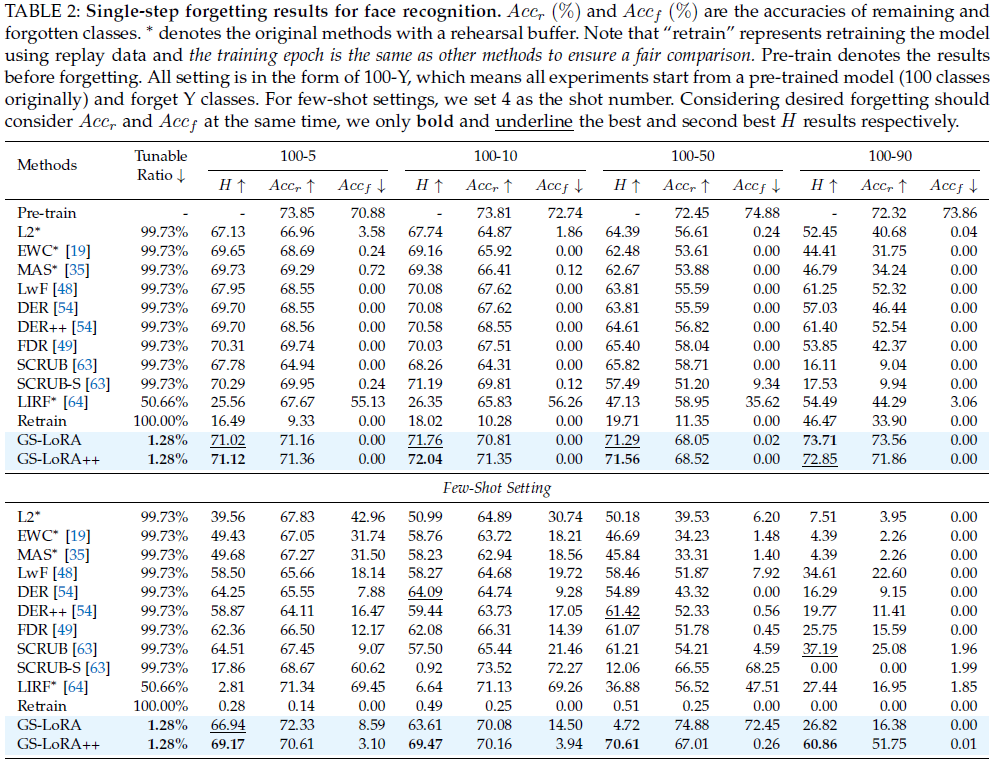
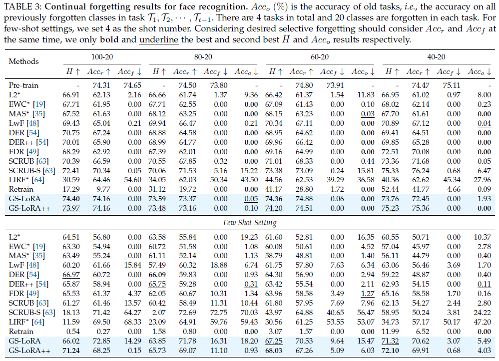
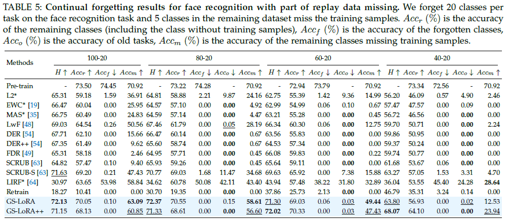

# Continual Forgetting for Pre-trained Vision Models (CVPR2024)


This is the official implementation of ***GS-LoRA*** (CVPR 2024). GS-LoRA is effective, parameter-efficient, data-efficient, and easy to implement continual forgetting, where selective information is expected to be *continuously* removed from a pre-trained model while maintaining the rest. The core idea is to use LoRA combining *group* *Lasso* to realize fast model editing. For more details, please refer to:

**Continual Forgetting for Pre-trained Vision Models [[paper](https://arxiv.org/abs/2403.11530)] [[video](https://www.youtube.com/watch?v=yigUY5v1Rgc)] [[video in bilibili](https://www.bilibili.com/video/BV1wi421C7PQ/?share_source=copy_web&vd_source=7bb418d0ef24f46374712edc865ed254)]**

[‪Hongbo Zhao](https://scholar.google.com/citations?user=Gs22F0UAAAAJ&hl=zh-CN), Bolin Ni, [‪Junsong Fan‬](https://scholar.google.com/citations?user=AfK4UcUAAAAJ&hl=zh-CN&oi=sra), [‪Yuxi Wang‬](https://scholar.google.com/citations?user=waLCodcAAAAJ&hl=zh-CN&oi=sra), [‪Yuntao Chen‬](https://scholar.google.com/citations?hl=zh-CN&user=iLOoUqIAAAAJ), [‪Gaofeng Meng](https://scholar.google.com/citations?hl=zh-CN&user=5hti_r0AAAAJ), [‪Zhaoxiang Zhang‬](https://scholar.google.com/citations?hl=zh-CN&user=qxWfV6cAAAAJ)

**Practical Continual Forgetting for Pre-trained Vision Models (**An extension of this paper**, where we consider more practical scenarios including few-shot settings and missing class settings) [[paper]()]**

[‪Hongbo Zhao](https://scholar.google.com/citations?user=Gs22F0UAAAAJ&hl=zh-CN), [Fei Zhu](https://impression2805.github.io/), Bolin Ni, [Feng Zhu](https://zhufengx.github.io/), [‪Gaofeng Meng](https://scholar.google.com/citations?hl=zh-CN&user=5hti_r0AAAAJ), [‪Zhaoxiang Zhang‬](https://scholar.google.com/citations?hl=zh-CN&user=qxWfV6cAAAAJ)

## Method


We incorporate a set of LoRA modules in each continual forgetting task and propose a sparse structure selection strategy and prototype regularization to achieve accurate and few modifications. (Left) All LoRA modules are added in the Linear layers of FFN in the Transformer blocks and we regard the LoRA modules in a
Transformer block as one group. We use group sparse regularization ($\mathcal{L}_{structure}$) to automatically select LoRA groups. The purple groups are selected to modify and the white groups are neglected. The pre-trained model (including Transformer blocks and other parts) is frozen and only LoRA groups are trainable. (Right) To achieve selective forgetting, we utilize selective forgetting and knowledge retention ($\mathcal{L}_{data}$). To further extend our method to more practical scenarios, we introduce
prototype regularization $\mathcal{L}_{pro}$. We use the original model to calculate the prototype of each class and pull away logits from its original prototype for each forgotten class and pull in logits from its own prototype for the remaining classes.

## Experimental results

### Single-step Forgetting



### Continual Forgetting

a. Continual forgetting results for face recognition



b. Continual forgetting results on ImageNet100


### Practical forgetting (missing class settings)



## Getting Started

### Installation

#### a. Clone this repository

```bash
git clone https://github.com/bjzhb666/GS-LoRA.git
cd GS-LoRA
```

#### b. Install the environment

```bash
conda create -n GSlora python=3.9
pip install -r requirements.txt
```

#### c. Prepare the datasets

##### c.1 CASIA-100 dataset

```bash
mkdir data
cd data
unzip data.zip
```

You can get our CASIA-100 in [https://drive.google.com/file/d/16CaYf45UsHPff1smxkCXaHE8tZo4wTPv/view?usp=sharing](https://drive.google.com/file/d/16CaYf45UsHPff1smxkCXaHE8tZo4wTPv/view?usp=sharing), and put it in the data folder.

Note: CASIA-100 is a subdataset from  [CASIA-WebFace](https://paperswithcode.com/dataset/casia-webface). We have already split the train/test dataset in our google drive.

##### c.2 ImageNet100 dataset

We get ImageNet100 dataset from [ImageNet100](https://www.kaggle.com/datasets/ambityga/imagenet100).

##### c.3 Final File structure

```
.
├── faces_webface_112x112_sub100_train_test
│   ├── test
│   └── train
├── imagenet100
│   ├── imagenet_classes.txt
│   ├── test
│   └── train
└── Labels.json
```

## Pretrain a Face Transformer

```bash
mkdir result
cd result
```

You can use our [pre-trained Face Transformer](https://drive.google.com/file/d/1Qqeb8fx2_kLeGA1uuLzutpauvyqY3CSV/view?usp=drive_link) directly. Download the pre-trained weight and put it into the result folder

**Or** you can train your own pre-trained models.

Your result folder should be like this:

```bash
result
└── ViT-P8S8_casia100_cosface_s1-1200-150de-depth6new
    ├── Backbone_VIT_Epoch_1185_Batch_45020_Time_2024-09-26-03-26_checkpoint.pth
    └── config.txt
```

Code is in `run_sub.sh`

```bash
bash scripts/run_sub.sh
```

`test_sub.sh` is the test code for our Face Transformer. You can test the pre-trained model use it.

```bash
bash scripts/test_sub.sh
```

## Continual Forgetting and Single Step Forgetting

### a. Continual Forgetting and Few-shot Continual Forgetting

**We provide the code of all baselines and our methods GS-LoRA, GS-LoRA++ metioned in our paper.**

In `run_cl_forget.sh`, **LIRF, SCRUB, SCRUB-S, EWC, MAS, L2, DER, DER++, FDR, LwF, Retrain and GS-LoRA, GS-LoRA++** (**Main Table**)

### b. Single-step forgetting and Few-shot single-step forgetting

For baseline methods, you can still use `run_cl_forget.sh` and change `--num_tasks` to 1. (There are examples in `run_cl_forget.sh`.)

**For single step GS-LoRA, we recommend you to use `run_forget.sh`.**

### c. Continual Forgetting on ImageNet100

For continual forgetting on ImageNet100 dataset, please use `run_cl_forget_image.sh`.

### d. Missing class forgetting

Please use `run_cl_forget_open.sh`.

## Citation

If you find this project useful in your research, please consider citing:

```
@article{zhao2024continual,
  title={Continual Forgetting for Pre-trained Vision Models},
  author={Zhao, Hongbo and Ni, Bolin and Wang, Haochen and Fan, Junsong and Zhu, Fei and Wang, Yuxi and Chen, Yuntao and Meng, Gaofeng and Zhang, Zhaoxiang},
  journal={arXiv preprint arXiv:2403.11530},
  year={2024}
}
```

## Contact

Please contact us or post an issue if you have any questions.

## Acknowledgement

This work is built upon the [zhongyy/Face-Transformer: Face Transformer for Recognition (github.com)](https://github.com/zhongyy/Face-Transformer)

## License

This project is released under the [MIT License](https://github.com/bjzhb666/GS-LoRA/blob/master/LICENSE).
